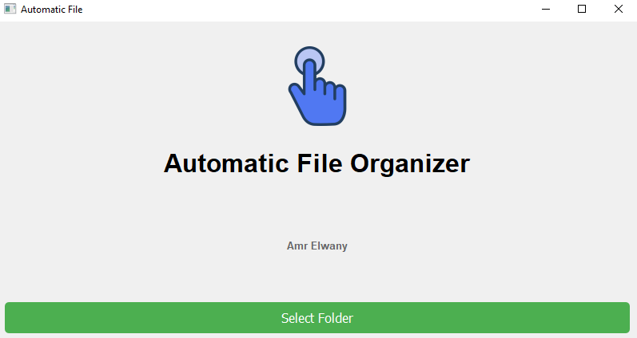
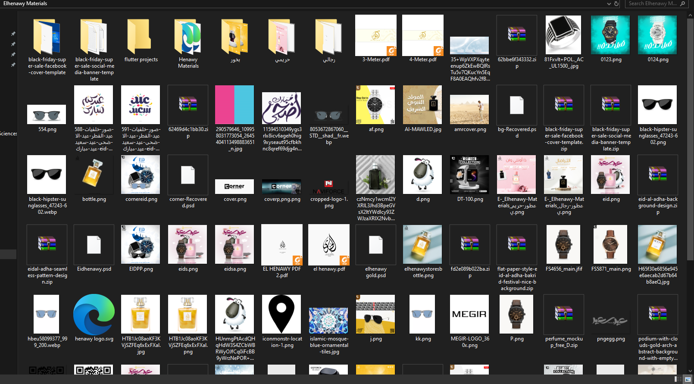
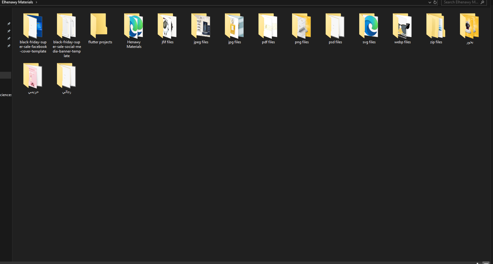
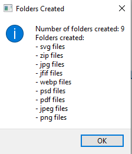

# Automatic File Organizer

## Overview
The **Automatic File Organizer** is a Python-based desktop application that helps users organize files into folders based on file extensions. It features an easy-to-use interface built with PyQt5.

## Features
- **Automatic Sorting**: Files are categorized into folders by their extensions.
- **User-Friendly Interface**: Simple and intuitive design for easy usage.
- **File Handling**: Alerts for files without extensions and informative messages on the organization process.

## User Interface

## Before Organizing

## After Organizing

## Summary

